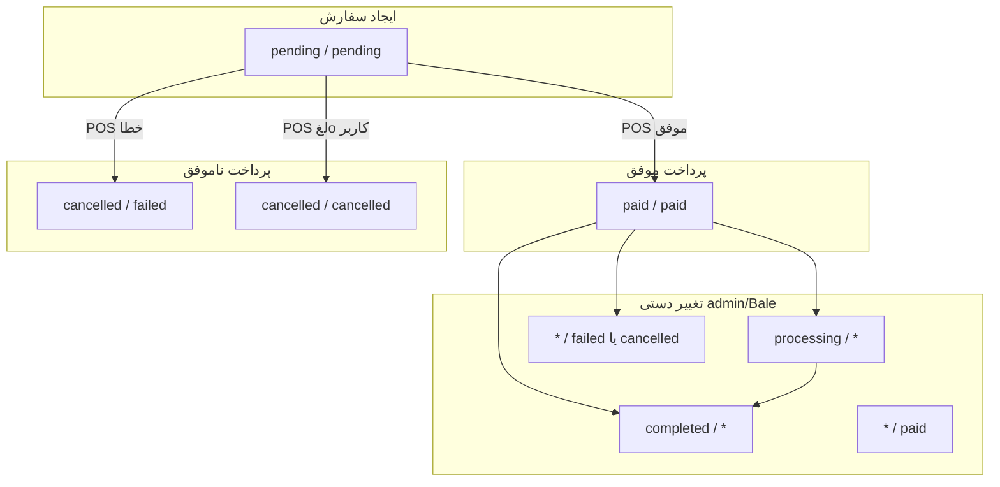

# وضعیت سفارش و پرداخت — مرجع فنی

این سند بر اساس کد واقعی monorepo (`kiosk_backend` + `kiosk_frontend`) نوشته شده است.

هر سفارش **دو فیلد مستقل** دارد:

| فیلد | معنی |
|------|------|
| **`order.status`** | فلو عملیاتی سفارش (آشپزخانه / تحویل) |
| **`payment_status`** | نتیجه پرداخت POS |

**خلاصه یک خطی:** `payment_status` مال پول و POS است (با side effect موجودی/چاپ روی `paid`)؛ `order.status` مال فلو عملیاتی است. در پرداخت ناموفق خودکار معمولاً هر دو با هم به حالت لغo/ناموفق می‌روند، ولی بعداً با admin/Bale می‌توانند از هم جدا بمانند.

---

## فهرست

1. [مقادیر مجاز](#۱-مقادیر-مجاز)
2. [نمود کلی](#۲-نمود-کلی)
3. [سناریوهای کیوسک](#۳-سناریوهای-کیوسک)
4. [Failure kinds (UX)](#۴-failure-kinds-فقط-ux)
5. [پنل ادمین و ربات بله](#۵-پنل-ادمین-و-ربات-بله)
6. [موجودی (Stock)](#۶-موجودی-stock)
7. [چاپ فیش](#۷-چاپ-فیش)
8. [Late POS](#۸-late-pos)
9. [گزارشات](#۹-گزارشات)
10. [جدول جمع‌بندی](#۱۰-جدول-جمع‌بندی-سناریوها)
11. [Edge cases و ناسازگاری‌ها](#۱۱-edge-cases-و-ناسازگاری‌ها)
12. [فایل‌های مرجع](#۱۲-فایل‌های-مرجع)

---

## ۱. مقادیر مجاز

### `order.status` (با `choices` در مدل)

| مقدار | برچسب فارسی | معنی عملیاتی |
|--------|-------------|--------------|
| `pending` | در انتظار | سفارش ساخته شده؛ هنوز پرداخت/تحویل نهایی نشده |
| `processing` | در حال پردازش | **فقط دستی** (ادمین / ربات بله) — کیوسک خودکار ست نمی‌کند |
| `paid` | پرداخت شده | پرداخت موفق؛ آماده آماده‌سازی |
| `completed` | تکمیل شده | سفارش تحویل/تمام شده |
| `cancelled` | لغو شده | سفارش لغو — شامل لغo بعد از پرداخت ناموفق |

**مدل:** `kiosk_backend/apps/orders/models.py`

### `payment_status` (CharField بدون constraint در DB)

| مقدار | کاربرد |
|--------|--------|
| `pending` | ایجاد سفارش |
| `processing` | **فقط دستی** — admin / Bale / UI |
| `paid` | پرداخت موفق |
| `failed` | خطای POS، timeout، شبکه، موجودی، PIN و… |
| `cancelled` | لغo کاربر روی POS یا کیوسک |

**Admin serializer:** `kiosk_backend/apps/admin_panel/api/orders/orders_serializers.py`

**Frontend TypeScript** گاهی `success` را هم می‌شناسد (legacy)؛ backend عمدتاً `paid` می‌نویسد:

- `kiosk_frontend/types/index.ts` → `OrderStatus`, `PaymentStatus`

---

## ۲. نمود کلی



`*` = آن فیلد تغییر نمی‌کند، مگر در مسیر `payment_status → paid` که `order.status` هم `paid` می‌شود.

---

## ۳. سناریوهای کیوسک

### ۳.۱ ایجاد سفارش

**Trigger:** مشتری «پرداخت» → `POST /kiosk/orders/orders/create/`

| بعد از ایجاد | Side effects |
|--------------|--------------|
| `status=pending`, `payment_status=pending` | اعتبارسنجی موجودی (**بدون کسر**)، ساخت `OrderItem`، **کوپن مصرف نمی‌شود**، **چاپ نمی‌شود** |

سپس backend **blocking** POS را صدا می‌زند (timeout طولانی — تا ~۳۰۰s در frontend).

**کد:** `OrderService.create_order_from_items` → `_process_payment`

---

### ۳.۲ پرداخت موفق (POS کد `00`)

| فیلد | مقدار |
|------|--------|
| `order.status` | `paid` |
| `payment_status` | `paid` |

**Side effects:**

- تخصیص `receipt_number`
- **کسر موجودی** (`StockService.decrease_stock`)
- **چاپ فیش** (background — `schedule_print`)
- مصرف کوپن
- UI: موفق، سبد خالی

**کد:** `_handle_successful_payment` → `update_payment_status(..., print_receipt=False)` + `schedule_print`

---

### ۳.۳ پرداخت ناموفق — خطا

**منطق:**

```python
unpaid_status = 'cancelled' if gateway_status == 'cancelled' else 'failed'
# همیشه: order.status = 'cancelled'
```

| نوع خطا | `payment_status` | `order.status` | `payment_failure_kind` (UX) |
|---------|------------------|----------------|-----------------------------|
| موجودی ناکافی (`51`, `02`) | `failed` | `cancelled` | `insufficient_funds` |
| PIN اشتباه (`55`, `03`) | `failed` | `cancelled` | `wrong_pin` |
| Timeout POS (~۶۰s DLL) | `failed` | `cancelled` | `timeout` |
| دستگاه مشغول (`93`) | `failed` | `cancelled` | `busy` |
| خطای شبکه / Exception | `failed` | `cancelled` | `timeout` یا `other` |

**Side effects مشترک:**

- موجودی **کسر نمی‌شود**
- چاپ **نمی‌شود**
- HTTP **402** + `payment_failure_kind`
- کوپن مصرف نمی‌شود
- در بیشتر failure kindها **سبد حفظ** می‌شود (`shouldKeepCartOnPaymentFailure`)

**کد:** `_persist_unpaid_payment_outcome` + `GatewayException`

---

### ۳.۴ لغo توسط کاربر روی POS (کد `81` یا `99`)

| فیلد | مقدار |
|------|--------|
| `order.status` | `cancelled` |
| `payment_status` | `cancelled` |

**لاگ:** `payment_cancelled_by_user`  
**UX:** `payment_failure_kind=cancelled`

---

### ۳.۵ لغo از کیوسک (دکمه «لغو پرداخت»)

**شرط:** `kiosk_payment_cancel_enabled=true` در تنظیمات سایت

| لایه | رفتار |
|------|--------|
| Frontend | UI فوری `cancelled`؛ poll تا **۹۰s** برای late success |
| Abort API | `POST /kiosk/payment/abort/` — فقط انتظار نرم‌افزار قطع می‌شود |
| POS واقعی | **فرمان لغo به دستگاه نمی‌رود** — باید روی خود پوز Cancel زده شود |
| Backend | وقتی POS جواب دهد: مثل §۳.۳ یا §۳.۴ |

> متن تنظیمات: «مبلغ روی دستگاه با لغo کیوسک پاک نمی‌شود.»

**کد:** `kiosk_backend/apps/payment/api/abort.py`, `pos_dll/gateway.py` → `request_cancel()`

---

### ۳.۶ Timeout کیوسک (۷۰ ثانیه بدون تعامل POS)

| لایه | رفتار |
|------|--------|
| Frontend | `PAYMENT_DEVICE_IDLE_MS=70000` → `abortPosWait()` → UI `failed` + `timeout` |
| Backend | DLL ~۶۰s بعد fail می‌دهد |
| DB | معمولاً `cancelled` / `failed` |

**کد:** `kiosk_frontend/app/(customer)/page.tsx`

---

### ۳.۷ Mock gateway

| نتیجه | `status` | `payment_status` |
|--------|----------|------------------|
| موفق | `paid` | `paid` |
| ناموفق تصادفی | `cancelled` | `failed` |

**کد:** `kiosk_backend/apps/payment/gateway/mock.py`

---

## ۴. Failure kinds (فقط UX)

فیلد DB نیست — برای modal کیوسک (`payment_failure_kind` در پاسخ 402).

| kind | شرط |
|------|-----|
| `insufficient_funds` | کد `02`, `51` |
| `wrong_pin` | کد `03`, `55` |
| `cancelled` | `status=cancelled` یا کد `81`, `99` |
| `timeout` | timeout / network |
| `busy` | کد `93` یا «مشغول» |
| `other` | بقیه |

**کد:** `kiosk_backend/apps/payment/gateway/failure_kind.py`, `kiosk_frontend/lib/payment-failure.ts`

---

## ۵. پنل ادمین و ربات بله

**Permission:** `change_orders`

### APIها

| Endpoint | Service |
|----------|---------|
| `PUT .../orders/{id}/update-status/` | `OrderService.update_order_status` |
| `PUT .../orders/{id}/update-payment-status/` | `OrderService.update_payment_status(..., print_receipt=True)` |
| `POST .../receipt/{order_number}/reprint/` | `PrintService.print_receipt` (فقط paid) |

**UI:** `kiosk_frontend/components/admin/OrderDetailsDialog.tsx` — دو dropdown مستقل.

### تغییر فقط `order.status`

- `payment_status` **ثابت** (مگر از مسیر پرداخت)
- چاپ **نمی‌شود**
- موجودی: **بدون تغییر** — **جز** `→ cancelled` روی سفارشی که قبلاً stock کسر شده

| مثال | نتیجه |
|------|--------|
| `paid` → `processing` | در حال آماده‌سازی |
| `paid` → `completed` | تحویل داده شد |
| `paid` → `cancelled` | سفارش لغo؛ **موجودی برمی‌گردد**؛ `payment_status` اگر paid بود → **cancelled** |

### تغییر فقط `payment_status`

| تغییر | `order.status` | Side effects |
|--------|----------------|--------------|
| → `paid` (اولین بار) | → `paid` | کسر stock، شماره فیش، **چاپ sync** |
| `paid` → `failed` | ثابت | **برگشت stock** (یک‌بار) |
| `paid` → `cancelled` | ثابت | **برگشت stock** (یک‌بار) |
| `failed` → `paid` | → `paid` | کسر stock + چاپ |

### ربات بله

- همان serviceهای بالا
- Quick action: failed → «علامت پرداخت‌شده»
- paid + not completed → «تکمیل»
- **صف نیازمند اقدام:** `payment_status=failed` یا `status` ∉ `{completed, cancelled}`

**کد:** `kiosk_backend/apps/bale_bot/handlers/router.py`, `menus.py`

---

## ۶. موجودی (Stock)

| رویداد | موجودی |
|--------|--------|
| ایجاد سفارش | فقط **validate** — رزرو/کسر نمی‌شود |
| اولین `payment_status → paid` | **کسر** (`change_type='sale'`) |
| پرداخت fail/cancel خودکار | **بدون تغییر** |
| Admin: `status → cancelled` | **برمی‌گردد**؛ اگر `payment_status=paid` بود → **`cancelled` هم می‌شود** |
| Admin: `paid → failed/cancelled/pending/...` | **برمی‌گردد** (یک‌بار، idempotent) |
| Late POS + موجودی ناکافی | order `paid` می‌شود **بدون کسر** (warning log) |
| `OrderService.cancel_order()` | همان `update_order_status(cancelled)` — **برگشت stock** |

| Admin/Bale همزمان | `select_for_update` روی سفارش + محصول؛ idempotent restore |

---

## ۷. چاپ فیش

| Trigger | چاپ |
|---------|-----|
| پرداخت موفق عادی (کیوسک) | ✅ background |
| Admin/Bale → `paid` | ✅ sync |
| Admin reprint | ✅ فقط paid |
| Late POS success | ❌ پیش‌فرض |
| Late POS + `print_receipt=True` | ✅ background |
| `payment_status != paid` | ❌ |

**کد:** `kiosk_backend/apps/orders/services/print_service.py`

---

## ۸. Late POS

**سناریو:** کاربر timeout/cancel دید؛ کارت دیرتر تأیید می‌شود.

| مرحله | رفتار |
|--------|--------|
| 1 | ابتدا `cancelled`/`failed` ذخیره می‌شود |
| 2 | PCPOS تا **۹۰s** زنده می‌ماند (`pos_dll/client.py`) |
| 3 | POS کد `00` → `finalize_late_pos_success` |
| 4 | اگر هنوز paid نشده → `paid`/`paid` + stock (چاپ پیش‌فرض: خیر) |
| 5 | Frontend poll `GET .../orders/{id}/status/` هر **۲.۵s** تا **۹۰s** |

**Race-safe:** `_persist_unpaid_payment_outcome` با `WHERE payment_status != 'paid'` — موفقیت دیررس روی paid overwrite نمی‌کند.

---

## ۹. گزارشات

| گزارش | فیلتر |
|--------|--------|
| فروش / درآمد | `order.status` ∈ `{paid, completed}` |
| تراکنش ناموفق | `payment_status = failed` |
| لغo‌شده | `payment_status = cancelled` یا `order.status = cancelled` |

**کد:** `kiosk_backend/apps/admin_panel/utils/report_constants.py`

⚠️ چون constraint DB روی هم‌خوانی دو فیلد نیست، ترکیب‌های عجیب (مثلاً `completed` + `failed`) **ممکن** است.

---

## ۱۰. جدول جمع‌بندی سناریوها

| # | سناریo | status | payment | stock | چاپ | سبد |
|---|--------|--------|---------|-------|-----|-----|
| 1 | سفارش جدید | pending | pending | — | ❌ | پر |
| 2 | POS موفق | paid | paid | ⬇️ | ✅ | خالی |
| 3 | POS fail | cancelled | failed | — | ❌ | حفظ* |
| 4 | لغo POS | cancelled | cancelled | — | ❌ | حفظ* |
| 5 | timeout کیوسک | cancelled | failed | — | ❌ | حفظ* |
| 6 | late POS موفق | paid | paid | ⬇️ | ❌** | خالی |
| 7 | admin → completed | completed | * | — | ❌ | — |
| 8 | admin → paid | paid | paid | ⬇️ | ✅ | — |
| 9 | mock fail | cancelled | failed | — | ❌ | حفظ* |

\* بسته به `payment_failure_kind`  
\** مگر `print_receipt=True`

---

## ۱۱. Edge cases و ناسازگاری‌ها

1. **`cancel_order` بدون API عمومی** — admin/Bale از `update_order_status` استفاده می‌کنند؛ هر دو مسیر stock را درست می‌کنند.
2. **`processing` هرگز خودکار ست نمی‌شود** — فقط admin/Bale.
3. **`payment_status` بدون DB constraint** — مقادیر legacy مثل `success` در UI ممکن است.
4. **Revert دستی paid → failed/cancelled** — stock **برمی‌گردد** (idempotent اگر status هم cancelled شود).
5. **Admin: status=cancelled ولی payment=paid** — در گزارش فروش ممکن است هنوز شمرده شود.
6. **لغo کیوسک ≠ لغo POS** — abort فقط wait را قطع می‌کند.
7. **Bridge gateway** — cancel از راه دور پشتیبانی نمی‌شود.
8. **Mock failure** — گاهی پیام «cancelled by user» با `status=failed` (نه cancelled).
9. **دو منبع حقیقت analytics** — فروش: `order.status`؛ شکست: `payment_status`.

---

## ۱۲. فایل‌های مرجع

| موضوع | مسیر |
|--------|------|
| مدل Order | `kiosk_backend/apps/orders/models.py` |
| منطق اصلی | `kiosk_backend/apps/orders/services/order_service.py` |
| API کیوسک | `kiosk_backend/apps/orders/api/orders/` |
| Abort پرداخت | `kiosk_backend/apps/payment/api/abort.py` |
| POS DLL | `kiosk_backend/apps/payment/gateway/pos_dll/` |
| POS TCP | `kiosk_backend/apps/payment/gateway/pos/` |
| Mock | `kiosk_backend/apps/payment/gateway/mock.py` |
| Failure kind | `kiosk_backend/apps/payment/gateway/failure_kind.py` |
| چاپ | `kiosk_backend/apps/orders/services/print_service.py` |
| Stock | `kiosk_backend/apps/products/services/stock_service.py` |
| Admin orders API | `kiosk_backend/apps/admin_panel/api/orders/id/orders_id_apis.py` |
| UI مشتری | `kiosk_frontend/app/(customer)/page.tsx` |
| Payment modal | `kiosk_frontend/components/customer/PaymentModal.tsx` |
| Failure UX | `kiosk_frontend/lib/payment-failure.ts` |
| Admin modal | `kiosk_frontend/components/admin/OrderDetailsDialog.tsx` |
| Bale bot | `kiosk_backend/apps/bale_bot/handlers/router.py` |

---

## اسناد مرتبط

| فایل | موضوع |
|------|--------|
| `docs/POS_PROTOCOL_AND_TROUBLESHOOTING.md` | پروتکل و عیب‌یابی POS |
| `docs/POS_ONSITE_CHECKLIST.md` | چک‌لیست راه‌اندازی POS |
| `docs/BALE_BOT.md` | ربات بله |
| `docs/OPERATIONS.md` | عملیات و معماری |

---

*آخرین به‌روزرسانی: بر اساس branch `feature/tauri-desktop` — برای تغییرات بعدی در `order_service.py` این سند را هم به‌روز کنید.*
